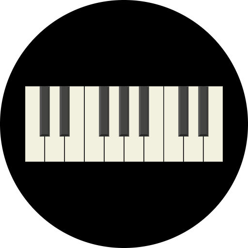
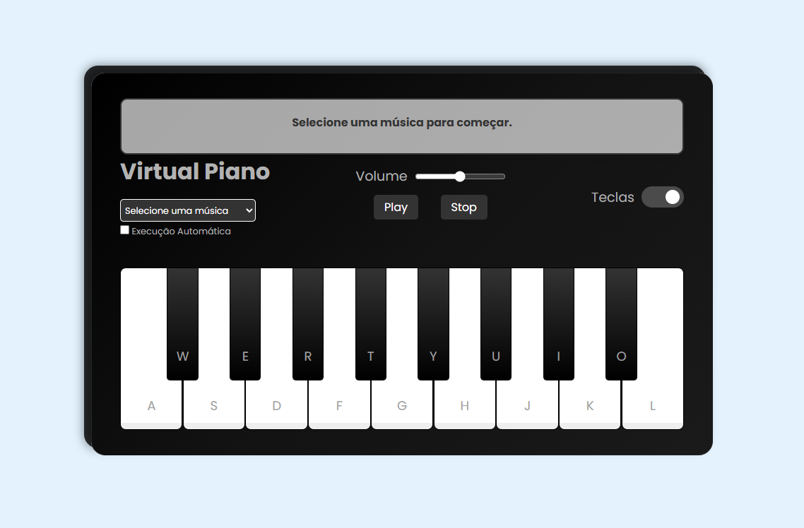

#  Piano Virtual 

Seja bem-vindo(a) ao **Piano Virtual**! Um projeto interativo que permite tocar músicas diretamente no navegador com diversas opções de personalização e funcionalidade.




## Índice

- Objetivo
- Descrição do Projeto
- Como Utilizar
- Tecnologias Utilizadas
- Estrutura do Projeto
- Mapeamento de Teclas para Notas
- Funcionalidades
- Funcionalidades Futuras
- Contribuições
- Contato
- Observações

## 🎯 Objetivo

Criar uma aplicação que simule um piano virtual, permitindo aos usuários aprender e explorar músicas de maneira interativa e personalizada, com controle sobre a execução e a visualização.

## 📖 Descrição do Projeto 

O Piano Virtual é uma aplicação web que permite tocar ou ouvir músicas de forma interativa. Os usuários podem selecionar músicas, ajustar o volume, visualizar ou ocultar as teclas correspondentes e seguir as instruções visuais para tocar as notas certas. A aplicação também oferece controles básicos como *play* e *stop* para maior conveniência.

## 🎶 Como Utilizar

1. **Acessar a Página**:
   - Acesse a aplicação hospedada clicando [aqui](https://projeto.vercel.app).
   - Ou abra o arquivo `index.html` localmente no navegador para visualização offline.

2. **Selecionar Música**:
   - Escolha uma música da lista disponível no menu.

3. **Escolher Modo de Interação**:
   - **Tocar Manualmente**: Siga as teclas destacadas para tocar a música.
   - **Executar Automaticamente**: Clique em *play* para ouvir a música sendo reproduzida automaticamente.

4. **Ajustes Opcionais**:
   - Controle o volume usando o slider de volume.
   - Visualize ou oculte as teclas correspondentes com o botão "Visualizar Teclas".

5. **Controles de Execução**:
   - Use os botões *play* e *stop* para iniciar ou parar a execução da música.

## 🛠️ Tecnologias Utilizadas 


 

- **HTML5**: Para a estruturação do conteúdo.
- **CSS3**: Para estilização visual do piano.
- **JavaScript**: Para controlar a lógica de reprodução, interação e manipulação das músicas.

## 🗂️ Estrutura do Projeto 

A organização dos arquivos no projeto é a seguinte:

```
| index.html
| README.md
| src/
| ├── images/
| │   └── (imagens e icones)
| ├── scripts/
| │   └── (scripts)
| ├── styles/
| │    └── (estilos)
| └── tunes/  
|     └── (áudios)

```

## 🎹 Mapeamento de Teclas para Notas

### Teclas e suas notas correspondentes:

| Tecla | Nota        |
|-------|-------------|
| a     | C (Dó)      |
| w     | C# (Dó sus) |
| s     | D (Ré)      |
| e     | D# (Ré sus) |
| d     | E (Mi)      |
| r     | F (Fá)      |
| f     | F# (Fá sus) |
| t     | G (Sol)     |
| g     | G# (Sol sus)|
| y     | A (Lá)      |
| h     | A# (Lá sus) |
| u     | B (Si)      |
| j     | C (Dó)      |
| i     | C# (Dó sus) |
| k     | D (Ré)      |
| o     | D# (Ré sus) |
| l     | E (Mi)      |

### Explicação:

- **Teclas brancas** (a, s, d, f, g, h, j, k, l) correspondem às notas naturais: C, D, E, F, G, A, B.
- **Teclas pretas** (w, e, r, t, y, u, i, o) correspondem às notas sustenidas: C#, D#, F#, G#, A#, B#.


## ⚙️ Funcionalidades 

- Escolha de músicas para tocar ou ouvir.
- Reprodução automática de músicas selecionadas.
- Controles de volume.
- Exibição opcional das teclas correspondentes.
- Destaque visual das teclas necessárias ao tocar manualmente.
- Botões *play* e *stop* para controlar a execução.

## 🌟 Funcionalidades Futuras

- Design responsivo para dispositivos móveis.
- Opção para gravar e salvar performances.
- Inclusão de mais músicas e timbres.
- Tutorial interativo para iniciantes.

## 🤝 Contribuições

Contribuições são bem-vindas! Para contribuir:

- **Abra uma Issue:** Relate um bug ou sugira uma melhoria.
- **Crie um Pull Request:** Faça alterações no código e envie uma solicitação para revisão.

## 📧 Contato

Para dúvidas ou feedback, entre em contato:

- **E-mail:** [nina.kastro@icloud.com](mailto:nina.kastro@icloud.com)
- **LinkedIn:** [LinkedIn](https://www.linkedin.com/in/karinacmartins/)
- **GitHub:** [GitHub](https://github.com/karinacmartins)

## Observações

A aplicação foi desenvolvida com foco em aprendizado. Sinta-se à vontade para explorar e compartilhar suas sugestões.

<br>
<br>

<div align="right">Made with 💜 by <a href="https://github.com/karinacmartins">KM</a>.</div>
